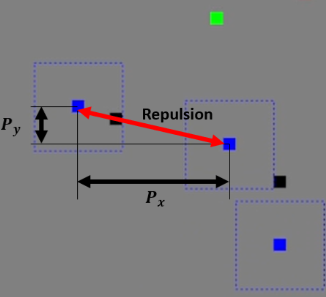
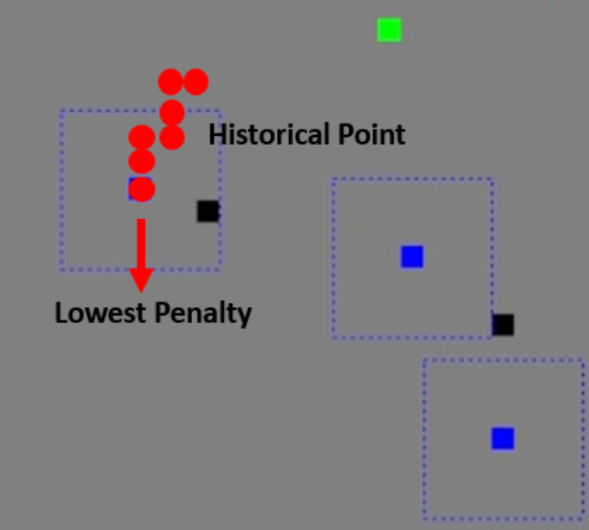
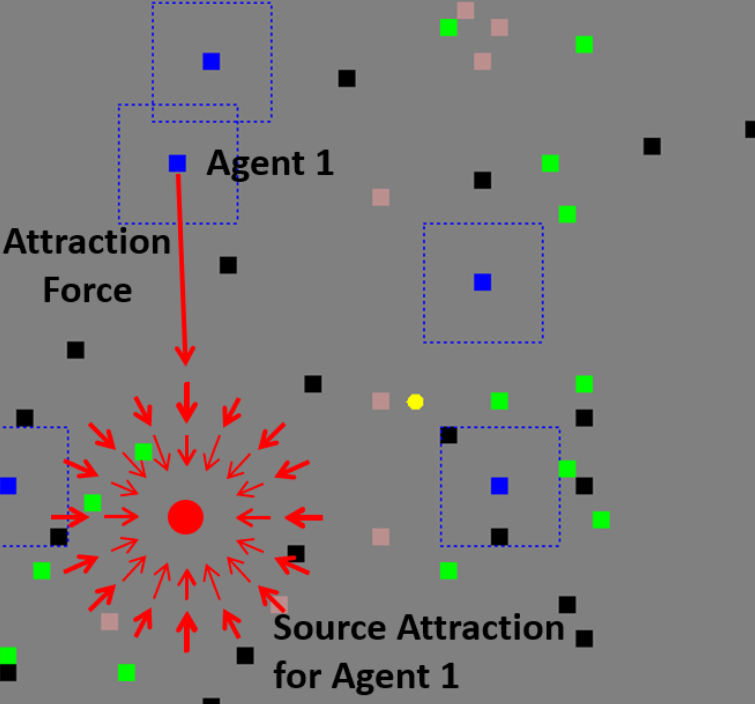
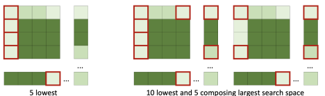
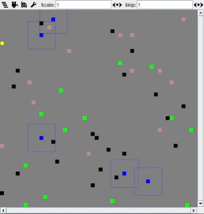

# MultiAgentSystem - TileWorld

This project enhances a communication protocol with three exploration techniques for the TileWorld challenge, focusing on improved agent coordination through refined communication and memory modules. Strategies such as fuel station searches, agent lifetime estimation, and refueling are developed to reduce failure rates. The Hungarian algorithm reallocates agents to optimize exploration. Future work might integrate heuristic algorithms with Reinforcement Learning for better results.

**Team Members**: Yiyang Luo, Li Dunhan, Fu Ziming, Nigel Leong, Chen Zhuoqun

### Agent Repulsion Penalty
We introduced a "Agent Repulsion Penalty" that applies a repulsive force inversely proportional to the distance between agents, effectively reducing clustering and improving resource usage.

  

### History-Based Penalty
The "History-Based Penalty" discourages agents from revisiting old paths by using historical data to steer them towards unexplored areas, optimizing exploration and resource distribution.

  

### Source Attraction Reward
This mechanism targets agents towards lesser-explored regions by increasing attraction forces based on the agent's distance from virtual sources, promoting exploration of new areas.

  

### Heat Map Calculation
We employ a heat map to direct agents to the least visited areas. This method calculates optimal grid sizes and applies decay factors to older data to maintain relevance. Our refined approach selects distant grids to avoid clustering and ensure comprehensive coverage.

  

## Requirements

- Install `Java JDK` and the JDK version should be `1.8`.
- Install the `Java3D` library (version 1.5). You can download the library file [here](https://www.oracle.com/technetwork/java/javase/tech/index-jsp-138252.html) and install the library [following](https://download.java.net/media/java3d/builds/release/1.5.1/README-download.html).
- Download the `MASON_14.jar` file and use this jar file as the external library for compiling and running.

## Results

The effectiveness of our strategies is demonstrated through simulation and experimentation. The comparison of our integrated strategies against a baseline greedy strategy under two different map configurations is illustrated below.

**Simulation:**

  

**Map Configuration:**
|            |  Env1   |  Env2   |
| :--------: | :-----: | :-----: |
|    Size    | 50 * 50 | 80 * 80 |
|    *μ*     |   0.2   |    2    |
|    *σ*     |  0.05   |   0.5   |
|  Lifetime  |   100   |   30    |
| Fuel-level |   500   |   500   |
|   Steps    |  5000   |  5000   |

Table 1: Map Configuration.

**Performance Summary:**

| Strategy                                    | Total Rewards (50 × 50) | Total Rewards (80 × 80) |
|---------------------------------------------|-------------------------|-------------------------|
| Random Direction (Pure Greedy Agent)        | 282.0                   | 578.0                   |
| ARP + HBP + SAR + Enhancement               | 604.0                   | 880.5                   |

Table 2: The average score for each environment configuration in 10 tests.

**Detailed Strategy Comparison:**

| Exploration Strategy                        | Total Rewards (50x50)   | Total Rewards (80x80)   |
|---------------------------------------------|-------------------------|-------------------------|
| Random Direction (Pure Greedy Agent)        | 282.0                   | 578.0                   |
| Agent Repulsion Penalty (ARP)               | 295.7                   | 611.8                   |
| History-Based Penalty (HBP)                 | 507.6                   | 766.4                   |
| Source Attraction Reward (SAR)              | 589.8                   | 883.8                   |
| Combined ARP, HBP, SAR                      | 604.0                   | 880.5                   |

Table 3: The average score for each environment configuration under different exploration strategies in 10 tests.

Results across two map sizes demonstrate varying strategy effectiveness. The Random Direction approach showed limited success, offering the lowest rewards. The Agent Repulsion Penalty (ARP) enhanced coverage by reducing clustering. The History-Based Penalty (HBP) was particularly effective in larger maps by preventing repetitive paths, while the Source Attraction Reward (SAR) led in guiding agents to less explored areas, especially in the 80x80 map. The combined use of ARP, HBP, and SAR provided the highest rewards, indicating that a balanced approach to exploration and exploitation is most effective. However, there was a slight performance dip in the larger map due to potential strategy overlap, highlighting the need for diverse tactics in complex environments.
